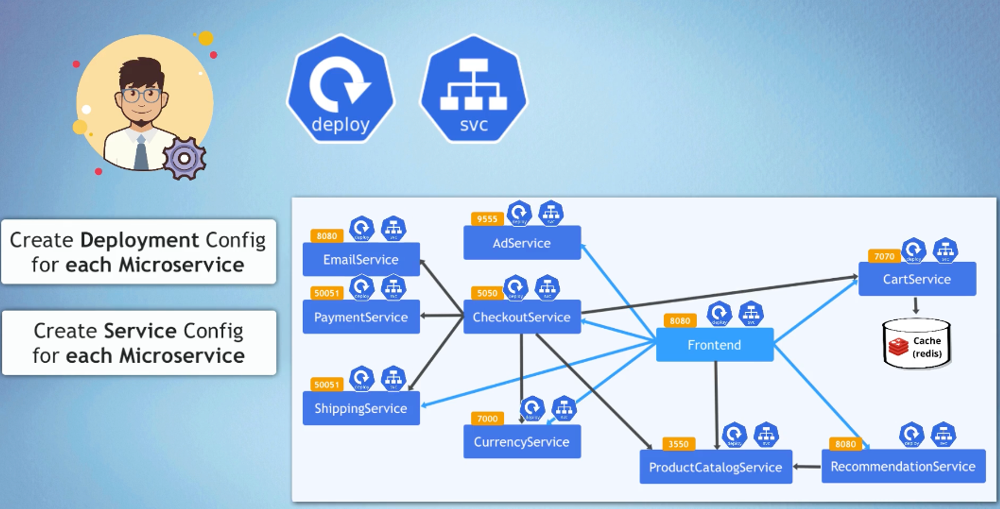

# 🚀 Helm Chart Deployment for Microservices

This repository provides a Helm chart configuration to deploy multiple microservices on a Kubernetes cluster. Each microservice has its own values file that specifies the deployment details.


## 🌟 Overview

This Helm configuration deploys a set of microservices, including Redis, Email Service, Cart Service, Currency Service, Payment Service, Recommendation Service, Product Catalog Service, Shipping Service, Ad Service, Checkout Service, and Frontend Service.

## 🛠️ Prerequisites

- Helm 3.0 or later
- Kubernetes cluster
- kubectl configured to interact with the cluster

## 🚀 Usage

To use this Helm configuration, follow these steps:

1. **Clone the repository**:
   ```sh
   git clone https://github.com/yourusername/your-repo-name.git
   cd your-repo-name
   ```

2. **Add Helm repositories**:
   ```sh
   helm repo add stable https://charts.helm.sh/stable
   helm repo update
   ```

3. **Deploy the Helm charts**:
   ```sh
   helm install -f values/redis-values.yaml rediscart charts/redis
   helm install -f values/email-service-values.yaml emailservice charts/microservice
   helm install -f values/cart-service-values.yaml cartservice charts/microservice
   helm install -f values/currency-service-values.yaml currencyservice charts/microservice
   helm install -f values/payment-service-values.yaml paymentservice charts/microservice
   helm install -f values/recommendation-service-values.yaml recommendationservice charts/microservice
   helm install -f values/productcatalog-service-values.yaml productcatalogservice charts/microservice
   helm install -f values/shipping-service-values.yaml shippingservice charts/microservice
   helm install -f values/ad-service-values.yaml adservice charts/microservice
   helm install -f values/checkout-service-values.yaml checkoutservice charts/microservice
   helm install -f values/frontend-values.yaml frontendservice charts/microservice
   ```

## 📦 Values Files

Each microservice has its own values file that defines the configuration for the Helm chart. 

## 📝 Helm Release Configuration

Here is the Helm release configuration for deploying the microservices:

```yaml
releases: 
  - name: rediscart
    chart: charts/redis
    values: 
      - values/redis-values.yaml
      - appReplicas: "1"
      - volumeName: "redis-cart-data"

  - name: emailservice
    chart: charts/microservice
    values:
      - values/email-service-values.yaml

  - name: cartservice
    chart: charts/microservice
    values:
      - values/cart-service-values.yaml

  - name: currencyservice
    chart: charts/microservice
    values:
      - values/currency-service-values.yaml   

  - name: paymentservice
    chart: charts/microservice
    values:
      - values/payment-service-values.yaml

  - name: recommendationservice
    chart: charts/microservice
    values:
      - values/recommendation-service-values.yaml

  - name: productcatalogservice
    chart: charts/microservice
    values:
      - values/productcatalog-service-values.yaml

  - name: shippingservice
    chart: charts/microservice
    values:
      - values/shipping-service-values.yaml

  - name: adservice
    chart: charts/microservice
    values:
      - values/ad-service-values.yaml

  - name: checkoutservice
    chart: charts/microservice
    values:
      - values/checkout-service-values.yaml

  - name: frontendservice
    chart: charts/microservice
    values:
      - values/frontend-values.yaml
```

## 🎨 Visual Explanation



This diagram illustrates the architecture and configuration for deploying multiple microservices using Helm. Here's a breakdown of the key elements:

### Key Elements:

- **Microservices**: Each rectangle represents a microservice deployed in the Kubernetes cluster. Examples include `EmailService`, `PaymentService`, `CartService`, etc.
- **Ports**: The orange labels (e.g., `8080`, `7070`, `50051`) indicate the ports on which each service listens.
- **Connections**: The lines connecting the microservices illustrate the communication paths between them. For example, the `CheckoutService` interacts with multiple services like `PaymentService`, `EmailService`, `ShippingService`, etc.
- **Redis Cache**: The `CartService` is depicted as connecting to a Redis cache for storing cart data.
- **Deployment and Service Config**: The icons represent the deployment and service configuration in Kubernetes for each microservice, ensuring they are properly deployed and accessible.

### Description:

- **Deployment Configurations**: Each microservice has a deployment configuration to manage the number of replicas, the Docker image used, and other runtime configurations.
- **Service Configurations**: Each microservice also has a service configuration that defines how the service is exposed within the Kubernetes cluster, including port configurations and environment variables.

This setup ensures that each microservice is independently deployed and managed, while also being able to communicate with other microservices in the architecture.
